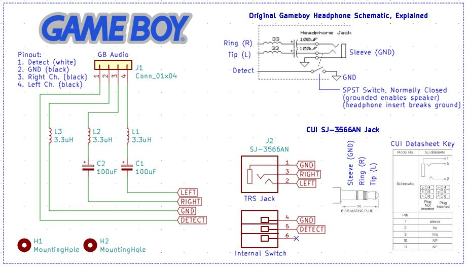

# Gameboy DMG Headphone Jack PCB
A replacement Gameboy DMG headphone jack PCB utilizing all newly manufactured parts -- yes, even the jack.

## Intro
To start off, one of my orginal Gameboys has headphone jack issues, and no amount of cleaning fixed it. I tried every YouTube tutorial, forum advice, Discord advice, etc. Surely, someone has to have made a near OEM style replacement right? I guess not. Every replacement board I could find uses the old Gameboy DMG headphone jack. I did find one completely new design in the Super DMG 01, but that strays too far from OEM and has a lot of unnecessary parts if you just want a cheap and simple replacement. \
\
After work one day, I decided to take a look at what made people keep using the original corroding jacks on replacement boards. Was it the size / form factor of finding the right replacement? Maybe. Was it confusing to figure out? Apparently. I found all sorts of weird pinouts people tried to draw, people claiming the audio was looping through the jack and back to the speaker, and arguing back and forth over drawing diagrams of how it works. It even confused me, because some people claimed to be confidently correct, then would be proven wrong by someone else. I decided to step back and look at the original Gameboy DMG schematic. After looking at the schematic, it only took about 30 seconds to figure out. But are modern day parts available for the solution? After a brief search on Mouser, it turns out yes.

## How It Works
Looking at the original Gameboy DMG schematic, we're really only interested in the "headphone jack" section as pictured below.
\
\

\
\
Here, it shows there's a switch going to ground that is controlled by the tip switch. Nintendo made this schematic simplified compared to the actual jack, so think of it as a separate single pole switch. It does not work in the same way as a normal tip or ring switch on most headphone jacks. It acts more like a SPDT isolated switch, telling the "detect" pin to short to ground or not. This is a normally closed contact, so when it is grounded, the speaker functions. When it is an open contact (ungrounded), the speaker turns off and the headphones function. The control for the detect line is done on the DMG motherboard in the audio amplifier. This is key to be able to duplicate this function properly. A simple tip or ring switchable headphone jack won't perform the detect pin --> ground switching properly without additional circuitry. I think this is where everyone got confused, or couldn't find the right parts.
\
\
Enter the CUI SJ-3566AN 3.5mm headphone jack. This is a special kind of jack that isn't used widely, but still exists for certain applications. It has an isolated SPDT switch controlled by the tip switch, which will allow us to do the proper detect pin --> ground switching we need. 
\
\
Below shows my KiCAD schematic for how it works. You'll notice the CUI headphone jack has pins 4, 5, and 6 as an internal switch. With the headphones unplugged, only pins 4 and 5 are shorted. With the headphones plugged in, only pins 5 and 6 are shorted. The Gameboy DMG shorts detect and ground to activate the speaker, and an open connection on detect and ground to have audio go to the headphones. I simply utilized this SPDT switch to accomplish the switching. You could use other methods or additional chips to do it, but it would likely add complexity, cost, and extra build time.
\
\

## But NOS Still Exists!
I have recently tried that, which inspired this project. I'm not saying all new old stock items are bad, but they are degrading through means of oxidation depending on their storage environment. Even a brand new product sitting on the shelf for 30+ years degrades. I deal with this at work all the time. Metal contacts oxidize, electrolytic capacitors dry up or need to be reformed periodically, and PCBs can delaminate. Here's a few pictures of what I recently encountered. 
\
\
Order slip:
\

\
\
Brand new part out of the anti-static bag. Notice the oxidation on the metal in the headphone jack:
\

\
\
I cleaned it and tried all the tricks. DeoxIT spray first, Goldwipes between the contacts second, vinegar soak third, and sandpaper between the contacts fourth. It still wouldn't work. I tried sandpaper last, since that should only be used as a last resort. Sandpaper removes the surface plating which normally would be used to make a good electrical contact. However, the oxidation seems to have ate away that good plated surface long ago.
\

\
\
If these are truly "new old stock", you can't fault the seller unless they install and test them -- but then they would be a used item, not a new old stock item. Unfortunately, this is what you have to deal with when purchasing decades old parts. This project's goal is to eliminate the need to rely on the decay of new old stock parts, or the frustration pf trying to refurbish your existing headphone jack.

## Build Notes
I ordered my PCBs with 1.0mm thickness from JLCPCB. I'm not 100% sure if this is necessary, but I wanted to have extra headroom inside the Gameboy shell just to be sure it would fit. After you're done soldering the headphone jack and 4-pin cable, trim any excess protruding metal/solder off with side cutters to prevent impact with the top of the shell when it is assembled. 
\
\
In the repository, I have included a BOM Excel file. There's a link to my Mouser cart for the parts inside.

## Internal Case Mod Necessary / Installation Pictures
One mod is necessary to make this fit, because the headphone jack itself is larger than the original. I tried to find a smaller jack unsuccessfully. You'll need to cut away the old "walls" that went around the old headphone jack body. This will allow the new CUI SJ-3566AN to fit since it is a few millimeters larger. I used a pair of small side cutters. Leave the screw mounting holes in place, as you'll need them to screw the PCB down to. Be careful and don't cut too far (like I did) where you cut into the screw hole. It would be best to cut away the majority of the "walls", then use a small file to get the rest of the plastic around the screw holes.
\
\

\
\
And here's what it should look like screwed in place. Don't overtighten the screws, because there's a gap when it is tightened down all the way. Just make them snug to the point where the board doesn't move, but isn't flexing. You could also 3D print some small washers to fit between the PCB and screw holes if you'd like. 
\
\

\
\
Due to the OEM Gameboy DMG headphone jack having an offset of roughly 1mm and the new CUI jack not having an offset, it will fit closer to the left side of the external 3.5mm shell opening. Luckily there's enough room and no more case cutting is required. All my headphones still fit in the hole just fine. Grr, OCD problems.
\
\

## Closing Thoughts
This was a pretty fun project and I hope it helps out the community. As the supply of good/working original headphone jacks dwindle, we needed a solution like this to keep these handhelds alive. I tried to keep this one similar to OEM, but with updated parts. Feel free to utilize my design for your work, but please give me credit in your inspired works for figuring out this core design. Build and sell these if you want to make a few bucks along the way. Thanks!

Discussion: [My Reddit Post](https://www.reddit.com/r/Gameboy/comments/1aojew2/gameboy_dmg_headphone_jack_replacement/)

## Revision History
Rev 0 - Initial revision. Tested and working, good to build.

## License
This project is licensed under Creative Commons Legal Code CC0 1.0 Universal. Please view the LICENSE file in this Github Repository. 

